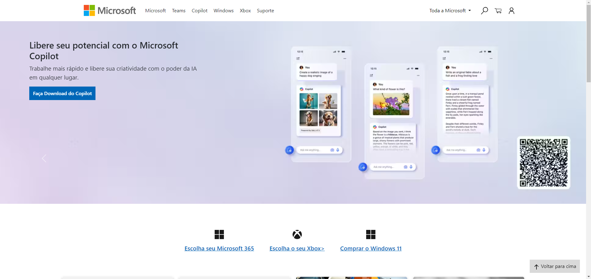

<h1 align="center"> Microsoft Page </h1>

Roberto Santos  
Desenvolvedor Web</h3>

  <a href="#tecnologias">Tecnologias</a>&nbsp;&nbsp;&nbsp;|&nbsp;&nbsp;&nbsp;
  <a href="#projeto">Projeto</a>&nbsp;&nbsp;&nbsp;

 

  

### 🚀 Tecnologias

O Portfólio foi desenvolvido utilizando HTML e CSS, utilizando também a responsividade.

✅ Uso semântico do HTML
✅ CSS
✅ Responsivo
✅ Git

 

### 💻 Sobre o Projeto

Esse projeto foi desenvolvido para praticar os meus conhecimentos e desenvolvimento web.

 

---

by betox.santos

"# Microsoft-Page" 
